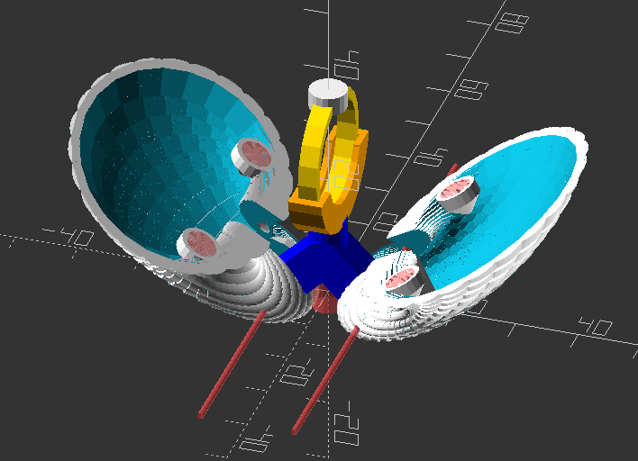
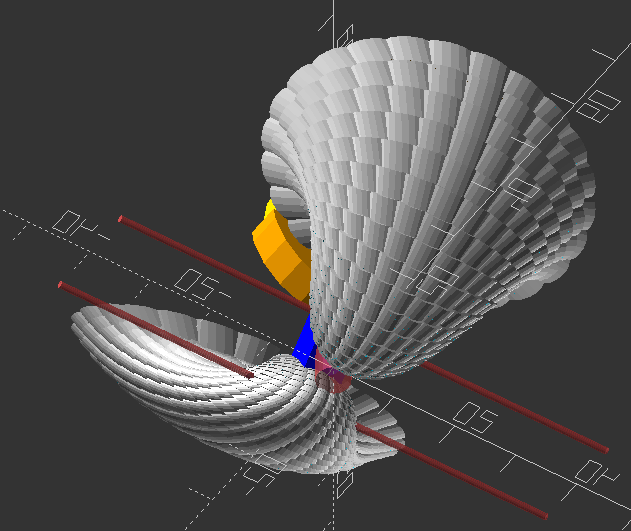

# Seashell ring box in openscad

It's a ring box in a proper clam shell.

Be careful of the capacity of the PC you render it on. 
Definitely turn down `$fn` for your first couple of tries.

## Credits

Original inspiration for the seashell generation code came from [SnowyEgret's scad-seashell](https://github.com/SnowyEgret/scad-seashell). Thanks for that!
